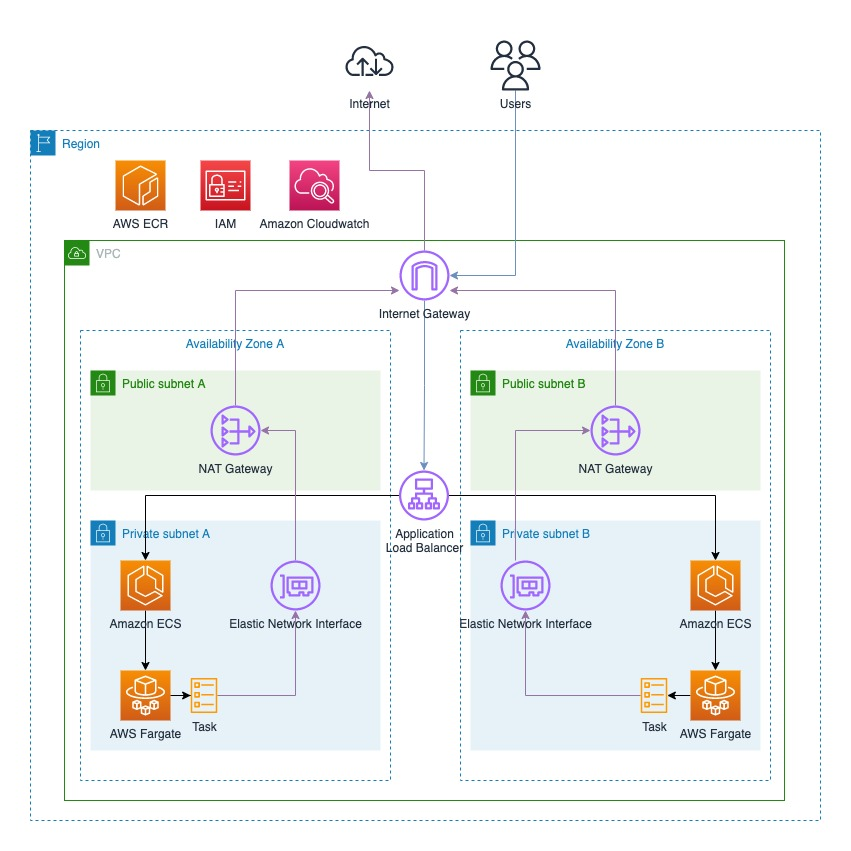

# AWS ECS Fargate Tutorial: Criando e deployando uma aplicação Node.js

Série de vídeos no Youtube explicando como construir e deployar uma aplicação Node.js usando o AWS ECS Fargate.

## Vídeos no Youtube
1. [Entendendo o que será construído](https://youtu.be/SwUC4sXEcqE)
2. [Implementando aplicação Node.js](https://youtu.be/UuSM26i39Fk)
3. [Criando imagem do Docker](https://youtu.be/MM-UTLKQ2Xc)
4. [Configurando AWS ECR](https://youtu.be/NF8iZp6rqps)
5. [Configurando VPC, Internet Gateway, Subnets e Route Tables](https://youtu.be/9x_GQanUWJM)
6. [Configurando o Load Balancer](https://youtu.be/IM6k8gM7co8)
7. [Finalizando a configuração do cluster do ECS e acessando a aplicação](https://youtu.be/UQnJyLnfbgw)
8. [Subindo uma nova versão da nossa aplicação no ECR e ECS](https://youtu.be/_eyU6A7bCqA)
9. [Deletando todos os recursos da nossa aplicação](https://youtu.be/erdoH56RarM)

## Diagrama de arquitetura

## Links

- [Ferramenta CIDR](https://cidr.xyz/)
- [O que é CIDR](https://en.wikipedia.org/wiki/Classless_Inter-Domain_Routing)
- [Fargate Network Mode](https://docs.aws.amazon.com/AmazonECS/latest/developerguide/AWS_Fargate.html#fargate-tasks-networkmode)
- [Analogia de uma VPC completa](https://start.jcolemorrison.com/aws-vpc-core-concepts-analogy-guide/)
- [Post oficial da AWS sobre a rede de uma task no Fargate](https://aws.amazon.com/blogs/compute/task-networking-in-aws-fargate/)

## Ordem de deleção dos recursos na AWS
1. ECS Service
2. Task definition
3. Load balancer
4. Target group
5. Service security group
6. Load balancer security group
7. NAT Gateways
8. Subnets
9. Dettach Internet Gateway
10. Delete Internet Gateway
11. Route tables
12. VPC
13. ECS Cluster
14. ECR
15. IAM
16. Cloudwatch